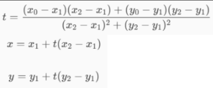

# Largada BR - Requisitos

# Inputs
- botão ORÇA fechada (1/2/reset)
- botão BOIA largada (1/2/reset)
- botão CONTAGEM para largada (5min/1min/fim)
- botão COMPARAR desempenho (1/2)
- velocidade do GPS
- lat/long do GPS

# Outputs
- audio (autofalante bluetooth)
- log em arquivo texto
  
Nota: o termo "avisar" = emitir áudio + logar em arquivo

# Medições do GPS

A cada 5s o RBR deve guardar a posição do veleiro (x0, y0) como as coordenadas de long e lat do GPS. TO DO: alguma conversão?

A cada 5s o RBR deve calcular o rumo a partir das coordenadas: fórmula (considerando 10s de deslocamento)

A cada 5s o RBR deve indicar se houve perda ou ganho de velocidade com relação a TBD

# Calculo da direção do vento estimado

INFO: Como o sistema não possui sensor de direção do vento, este é estimado pela bissetriz dos ângulos que o veleiro faz em orça fechada com vela à direita e com vela à esquerda.

Se o botão ORÇA for pressionado e o rumo não for constante pelas últimas 2 medidas, RBR deve avisar "Manter rumo e tentar novamente".

Se o botão ORÇA for pressionado pela primeira vez e o rumo for constante pelas últimas 2 medidas, RBR deve armazenar o ângulo como o1 e avisar "Orça 1 definida como XXX" (XXX em ponto cardinal no audio e graus no log)

Se o botão ORÇA for pressionado após o1 definido e o rumo for constante pelas últimas 2 medidas, RBR deve armazenar o ângulo como o2 e avisar "Orça 2 definida como XXX" (XXX em ponto cardinal no audio e graus no log)

Quando o1 e o2 estiverem definidos, RBR deve calcular angulo_vento como a bissetriz entre o1 e o1 e avisar "Vento calculado como XXX" (XXX em ponto cardinal no audio e graus no log)

Se o botão ORÇA for pressionado e o1 e o2 já estiverem definidos, RBR deve resetar o1, o2 e angulo_vento e avisar "Reset do vento estimado".

Se o rumo for constante por 4 medidas dentro da zona morta com velocidade >2kt, RBR deve deslocar a zona morta (o1 e o2) e o angulo_vento pela quantidade de graus que o rumo estiver adentro, e alertar "Vento calculado como XXX" (XXX em ponto cardinal no audio e graus no log)

# Calculo da linha de largada

INFO: A linha virtual de largada é calculada a partir da marcação das duas boias, levando o veleiro até elas para definir as suas coordenadas.

Se o botão BOIA for pressionado e x1/y1 estiverem zerados, RBR deve memorizar as coordenadas atuais (lat/long) como x1 e y1.

Se o botão BOIA for pressionado e x1/y1 estiverem definidos, RBR deve memorizar as coordenadas atuais (lat/long) como x2 e y2.

Se o botão BOIA for pressionado e x2/y2 estiverem definidos, RBR deve zerar os valores de x1, y1, x2 e y2.

Se x1, y1, x2 e y2 estiverem definidos, RBR deve calcular o ângulo angulo_montagem como: arctan((y1 - y2) / (x1 - x2)).

INFO: Idealmente o angulo_montagem das boias e o angulo_vento devem coincidir.

Se o angulo_montagem for maior que angulo_vento + 5, RBR deve avisar "Vantagem pela boia 2".

Se o angulo_montagem for menor que angulo_vento - 5, RBR deve avisar "Vantagem pela boia 1".

Se o angulo_montagem estiver entre angulo_vento +- 5, RBR deve avisar "Boias equivalentes".

# Contagem regressiva para largada

Se o botão CONTAGEM for pressionado pela primeira vez, RBR deve avisar "Contagem de 5 minutos" e iniciar uma contagem regressiva em 5:00.

Se o botão CONTAGEM for pressionado pela segunda vez, RBR deve avisar "Contagem de 1 minutos" e iniciar uma contagem regressiva em 1:00.

Se a contagem regressiva estiver em minutos redondos, RBR deve avisar "X minutos".

Se a contagem regressiva estiver menor igual a 10 segundos, RBR deve avisar "X" a cada segundo.

Se a contagem regressiva estiver menor que 5:00, RBR deve calcular a projeção ortogonal do veleiro na linha de largada (x3, y3), com a fórmula:

Se a contagem regressiva estiver menor que 5:00, RBR deve calcular a distância do veleiro até a linha como:  
sqrt((x3 - x0)² + (y3 - y0)²) * sqrt(2), 
onde x0, y0 representam a posição atual do veleiro.

TO DO: adicionar> Aviso de acelerar/reduzir velocidade no minuto final considerando dist e velocidade

# Comparação de desempenho

TO DO: adicionar> Comparação de desempenho em diferentes ajustes do veleiro

# Finalização da regata

Se o botão CONTAGEM for pressionado pela terceira vez, RBR deve registrar toda a trajetória acumulada em arquivo CSV contendo: tempo, coordenadas, rumo, velocidade, e avisar "Regata finalizada".
